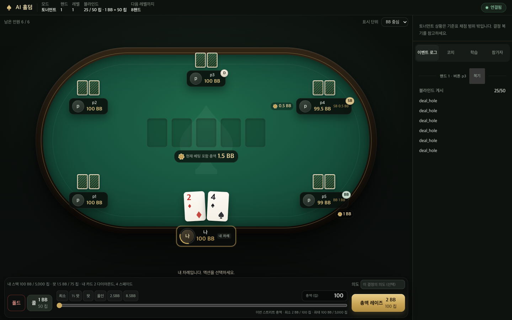

# AI Hold'em

**Play a hand. Understand your decisions. Come back sharper.**

A self-hosted, browser-based No-Limit Texas Hold'em playground with AI opponents, multiplayer tables, hand replays, and a personal study room.

[](https://github.com/Sungmin-Cho/AI-Holdem/actions/workflows/test.yml)
[](#quick-start)
[](LICENSE)

**English** · [한국어](README.ko.md)

[Quick start](#quick-start) · [Opponents](#choose-your-opponents) · [Multiplayer](#play-with-friends) · [Docs](#documentation) · [Contributing](#contributing)



Six-player tournament table from a browser test session (Korean UI).

## Why AI Hold'em?

- **Three ways to play against AI.** Local persona policies, LLM players through Claude Code, Codex, or Grok, and table-wide JEV opponents.
- **Your table, your pace.** Cash training and tournaments, 1–8 AI opponents in solo play, adjustable pace, and browser controls for pause, resume, and restart.
- **Review the decision, not just the result.** Attach an intent note to an action, replay completed hands, and read coaching and end-of-game reviews when a compatible LLM is available.
- **A study room that stays with you.** Track supported preflop spots and practice drills across sessions, even after the game ends.
- **Bring friends—or watch.** Host multiplayer rooms with human and AI seats, participant join links, and a spectator role.
- **A local engine owns the rules.** Cards, legal actions, chips, and side pots are handled by the engine. AI providers choose actions; they do not run the game.

The game UI is currently primarily Korean. This English README does not imply an English UI is available. Games use play chips; training feedback is heuristic, not a solver-backed GTO guarantee.

## Quick start

You need **Node.js 20+**, npm, and Git. Install dependencies even when using local opponents.

```bash
git clone https://github.com/Sungmin-Cho/AI-Holdem.git
cd AI-Holdem
npm ci
```

Start the app with an **absolute path** for your game store:

```bash
# macOS / Linux
npm run app -- "$PWD/game"
```

```powershell
# Windows PowerShell
npm run app -- "$($PWD.Path)\game"
```

Open the URL printed in your terminal, choose your settings, and start from the lobby. Opening the lobby does not start a game or an LLM call.

The default table is **cash training · 5 AI opponents · 100BB · 20 hands · local policy v2 · normal pace**. Local opponent decisions need no provider credentials. LLM coaching is optional; when unavailable, the game provides factual feedback from recorded events.

The app runs in the background. Stop it using the same store path:

```bash
npm run app:stop -- /absolute/path/to/game
```

Using Claude Code, Codex, or Grok inside this repository? Ask it to **`start game`**. The [start-game skill](.agents/skills/start-game/SKILL.md) opens the web lobby.

## Choose your opponents

Select an opponent mode in the lobby's advanced settings.

| Mode | Decision source | Requirements |
| --- | --- | --- |
| **Local policy** (default) | Versioned persona policies running locally | No player API key or LLM CLI |
| **LLM** | Tool-free CLI players with a conversation maintained during the game | An installed, authenticated, compatible Claude Code, Codex, or Grok CLI |
| **JEV** | TypeSafe AI's `jev-1.13.0` for every AI seat | `TYPESAFE_API_KEY` in the app server environment |

### LLM players and coaching

```bash
npm run app -- /absolute/path/to/game --player-runtime codex
# Alternatives: --player-runtime claude or --player-runtime grok
```

`--player-runtime` selects the CLI integration. Choose **LLM** in the lobby to use it for opponents. The same integration can provide coaching in local-policy or JEV games. Runtime compatibility and isolation are checked before use. Grok's player integration is currently unsupported on Windows. Provider authentication, model access, and usage limits apply.

### JEV players

Set `TYPESAFE_API_KEY` in your shell before starting the app, then select **JEV 플레이어 (테이블 전체)** in advanced settings. If the app is already running, stop it and relaunch it from that environment. `npm ci` installs the pinned JavaScript SDK; Python is not required.

Each request contains only the acting AI's own cards and public table state, using seat aliases. Other seats' hidden cards, participant names and IDs, chat, and intent notes are excluded. JEV chooses among legal action and amount candidates, and the app samples the action from the candidate probabilities. Failed requests wait for explicit recovery instead of silently switching to local policy. Coaching still uses the optional LLM integration or factual feedback.

## Play with friends

Open an online session from the lobby and share its **participant join link**. The public listener uses port **8899** by default. Players on the same reachable LAN can join; internet access requires your own networking and HTTPS setup. Share join links, not the private host URL.

Spectators do not occupy engine seats and can see **all hole cards live**. Use spectator access when that visibility is appropriate for your group. Multiplayer games are started and resumed through the app.

The default connection is HTTP. Public-host, port, and TLS configuration are covered in the [operations guide](docs/operations.ko.md#시작하기).

## Play → review → practice

1. **Play:** choose cash training or a tournament, set the pace, and record your thinking with an action note.
2. **Review:** open completed hands from the log and inspect their replays and feedback. Card visibility follows saved showdown and replay settings; exports include only showdown cards.
3. **Practice:** revisit supported spots in the study room and work through drills. Profiles and history belong to the store selected at startup.

Open or stop the independent study service for an existing store:

```bash
npm run study -- /absolute/store
npm run study:stop -- /absolute/store
```

The preflop reference covers specific 6-, 8-, and 9-player 100BB situations. Unsupported spots are not treated as solved. Scores and frequency comparisons do not establish profitability or poker skill. See the [training data notes](training/data/README.md) for coverage and provenance.

## How it works

```text
Browser lobby & table
        │
   App service ─── Game loop ─── Poker engine
                       │
                       ├── Local policy / LLM CLI / JEV
                       └── Session records ─── Study service
```

The app hosts one game loop at a time. The loop owns decisions, persistence, coaching, and completion; a separate study service owns post-game learning. The controlling agent is not part of the per-action loop.

Sessions are stored locally. LLM and JEV modes send permitted decision context to the selected provider. Keep private store files and host tokens private. Before upgrading or rolling back an active game, follow the [recovery guide](docs/operations.ko.md); preserve existing records and use a compatible version to roll-forward.

## Documentation

Some technical guides are currently in Korean.

| Guide | Contents |
| --- | --- |
| [Architecture](ARCHITECTURE.md) | Engine, app, relay, runtime, and persistence boundaries |
| [Operations and recovery](docs/operations.ko.md) | Legacy CLI, diagnostics, shutdown, resume, and recovery |
| [Start-game skill](.agents/skills/start-game/SKILL.md) | Agent-assisted launch workflow |
| [Training data](training/data/README.md) | Heuristic reference coverage and provenance |
| [JEV design](docs/implementation/jev-player-design.md) | Provider contract and failure handling |
| [JEV validation](docs/implementation/jev-player-validation.md) | Automated and real-provider verification |

## Contributing

Bug reports and focused pull requests are welcome. Include reproduction steps, OS and Node.js version, and opponent mode. Remove API keys, host URLs, tokens, and private game records from shared materials.

```bash
npm ci
npm run test:ci
npm run benchmark:policies
```

Run individual tests with `node --test test/<file>.test.js`. Browser journeys are available through `npm run test:lobby:browser`, `npm run test:multiplayer:browser`, and `npm run test:ui:browser`. They require browser tooling; multiplayer checks also need a reachable LAN IPv4 address. See the [CI workflow](.github/workflows/test.yml) for the browser installation used in automation.

Regular CI does not call the JEV API. The opt-in [live JEV journey](test/browser/jev-live-play.mjs) uses a temporary store and requires provider credentials.

## License

[Apache License 2.0](LICENSE).
