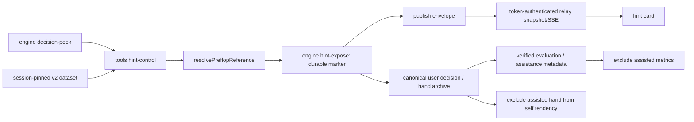

# #147 사전 힌트 설계

2026-09-08. 설계 기준 main `6bc286ae1671d30e90f71e104439520736b5f51f`, 브랜치 `feat/pre-action-hints-147`. 구현 전 문서다.

## 1. 목표와 근거

사용자가 자기 차례에 선택적으로 기준표 행동 빈도와 레이즈 사이징을 볼 수 있게 한다. 기본 플레이는 사전 정답 비노출을 유지한다. 도움을 받은 결정을 독립적인 학습 성과나 자기 성향으로 집계하지 않는다.

- [#147 원문과 댓글](https://github.com/Sungmin-Cho/AI-Holdem/issues/147): 기본 off, 사용자 차례, 행동 %, 사이징, 미지원 사유, 힌트 노출 기록 및 통계 분리.
- [#150 설계](issue-150-design.md), [플랜](issue-150-plan.md), [검증](issue-150-validation.md). PR #161 / `85665e3b2efcfa4dcf3d8ae0f2dede8c2a44573b`는 현재 기준 main의 조상이다.
- 위키 `ai-holdem-issue-150-reference-v2-2026-09-08.md`, `ai-holdem-gto-training-2026-09-01.md`, `ai-holdem-issue-144-self-opponents-2026-09-08.md` 본문을 읽고 현재 소스와 대조했다. 위키 index read는 `TRANSACTION_RECOVERY_REQUIRED`로 실패했으므로 카탈로그 정합성은 확인하지 못했다. 위키를 변경하지 않았다.
- #147 댓글의 top-up 부재 가정은 #150 실측으로 정정됐다. 현재 cash-training은 top-up이 있다. 정책 strength를 힌트에 개방할 필요도 없다. `resolvePreflopReference`가 선택 이전 source/actions/coverage를 제공한다.
- 기준 main에는 #162 자기 복제·공략 상대와 #163 decision meta-file/pending replay가 있다. 노출 기록은 자유 텍스트 `note`/`reason`과 분리하고, 성향 수집의 별도 오염 경로까지 닫는다.

## 2. 첫 구현 범위

| 항목 | 확정 동작 |
|---|---|
| 옵트인 | `tools/game-loop.js --store-dir ABS --hints on\|off`, 기본 off. 세션에 고정하고 resume에서 생략하면 저장값을 쓴다. 다른 값으로 재개하면 명시적 오류. 변경은 새 세션에서 한다. |
| 지원 | 세션이 pin한 v2 프리플랍만. 6/8/9인 cash-training, native/제한 투영의 정확한 지원 범위는 #150 그대로. |
| v1·legacy | 기존 v1·pre-contract v2 resume의 on은 기동 전 `HINT_SESSION_UPGRADE_REQUIRED`. 생략/off는 무변경. v2로 rebind하지 않는다. legacy `--game-dir --hints on`은 기동 전 사용법 오류. `HINT_SOURCE_UNSUPPORTED`는 내부 builder가 직접 받은 지원 밖 source의 방어 결과이며 v1을 on으로 기동하는 경로는 없다. |
| UI | 액션 바 위에 빈도·사이징·출처·직접/투영 참고·비채점 안내. UI 런타임 토글은 첫 범위에서 제외한다(#147의 플래그 또는 토글 중 플래그 선택). |
| postflop | `HINT_STREET_UNSUPPORTED`, 수치 없음. solver/LLM/cache를 시작하지 않으며 영구적인 “계산 중” 표시도 하지 않는다. |
| 제외 | 기준표 확대, 계수 변경, GTO/승률/EV 추정, 자동 행동/사이징 입력, 게임 중 과거 사후 평가 경계 완화, 정책 strength 소비자 추가. |

기존 **v2**에도 새 기본값을 소급하지 않는다. pre-contract 세션(저장 config에 hintContractVersion 없음)은 resume 옵션 생략/off를 무변경으로 허용하고 on은 `HINT_SESSION_UPGRADE_REQUIRED`로 기동 전에 거절한다. v1 pre-contract도 같은 resume 규칙이다. v1의 “숫자 미지원”은 source compatibility contract이며 이를 위해 v1 세션에 새 hint config를 삽입하지 않는다. 새 contract-bearing v2는 저장 on→생략/on, off→생략/off만 허용하고 반대값은 `HINT_MODE_CONFLICT`다. 새 on 세션은 현재 v2 canonical source를 유지한다.

힌트와 사후 평가는 서로 다른 계약이다. 사전 결과에 evaluationId, chosen frequency, grade, EV를 만들지 않는다. %는 휴리스틱 기준표의 행동 빈도이며 승률·성공률·최적성 확률이 아니다.

## 3. 소유권과 연결 지점



현재 `runAtomicStepPublish`는 엔진 step 후 `publishEnvelope`를 호출하고 `--wait`가 사용자 액션까지 기다린다. `handleUserTurn`에 조회를 넣으면 이미 사용자가 응답한 뒤라 늦다. **모든 사용자 view를 게시하기 전** 하나의 `prepareHintEnvelope` 경로로 모은다. bootstrap, 새 핸드, AI→user, reject resync, resume, server recovery, view-only resync를 포함한다. wait-only는 새 노출을 만들지 않는다.

새 순수 모듈 `training/pre-action-hint.js`는 v2 reference를 표현용 DTO로 바꾼다. `tools/hint-control.js`가 source read/cache/CLI를 소유한다. engine은 training/데이터셋을 import하지 않고 결정 identity와 노출 마커만 소유한다. 서버는 closed DTO와 canonical engine evidence를 검증한다.

relay의 reference 재검증은 기존 import 경계에 **명시적 예외 하나**를 추가한다: `server/server.js → tools/hint-proof.js`의 읽기 전용 `verifyHintPublication` named export. 이 façade만 pin된 source context/`loadReferenceDataset`/순수 v2 resolver를 호출한다. query의 canonical schema2 입력은 §5의 **engine이 직접 저장한 marker.observationSnapshot**이며 publisher의 view/legal을 신뢰하거나 raw state에서 legal을 재구현하지 않는다. façade에는 spawn/CLI/mutation/publish가 없고 engine betting 규칙을 실행하지 않는다. server의 training 직접 import 및 hint-control import는 계속 금지한다. `test/boundaries.test.js`와 ARCHITECTURE의 allowlist를 이 한 edge로 갱신한다. façade/데이터셋을 static route로 제공하지 않는다. dataset loader는 registry가 결정한 repo-relative 고정 경로만 받고 `openContained`의 regular-file/no-symlink·8MiB 상한으로 읽어 full source hash를 검증한다. source evidence는 session root의 기존 bounded read를 유지한다. 세 digest 계산은 shared 순수 함수 한 곳을 engine/tools/façade가 사용한다.

façade 파일 자체와 새로 도입하는 read-only helper도 static boundary 대상이다. named import는 readSessionReference/loadReferenceDataset/resolvePreflopReference/openContained 및 필요한 순수 shared 계약·node read/hash 기본 함수로 제한하며 namespace/dynamic import·child_process·쓰기 primitive를 금지한다. 기존 reference-source/training-store의 읽기/쓰기 혼합 모듈은 명시된 read export만 허용하는 예외다. 모든 기존 transitive writer를 통째로 read-only라고 주장하거나 모듈 전체를 허용하지 않는다. import 시 부작용 없음과 façade 실행 중 write/link/unlink/spawn 0회를 별도 검증한다.

## 4. 조회 및 표시 계약

조회 입력은 `decision-peek --for user --expect-version V`의 schema 2 snapshot과 `readSessionReference` → `loadReferenceDataset`의 객체다. `chosenAction`, 결과, 상대 홀카드, 정책 RNG/strength/traits를 사용하지 않는다. `resolvePreflopReference`만 호출하며 `comparePreflopChoice`·evaluator를 가짜 선택과 함께 호출하지 않는다.

신규 `hint` 필드는 discriminated closed object이고 최대 16KiB, 전체 publish 한도 65,536 bytes는 유지한다. 지원 객체의 필드:

```text
schemaVersion: 1
gameEpoch: existing gameEpochOf(sessionToken), token 자체 금지
decisionId, handNo, stateVersion: 노출 commit 이후 현재 engine identity
status: supported
source: {id, version, contentSha256} (세션 full triple와 동일)
coverage: #150 projectReferenceCoverage 결과
actions: [{action: fold|check|call|raise, frequency, raiseToChips?}]
exposureId: SHA256 identity
```

`coverage.choiceMatch='not-observed'`, `coverage.metricEligible=false`, chosenRaiseTo는 null이다. supported라도 metric authority가 아니다. positive 빈도 배열만 전달하고 source 원본 빈도는 변경하지 않는다. `raiseToChips`는 `coverage.reference.sizing`의 실제 정수칩과 같아야 한다. validation은 max 4개 고유 액션, finite positive frequency, 합 1(1e-9 허용), 정확한 optional size 필드와 legal을 확인한다. DTO handNo와 decisionId의 hand 번호도 canonical handNo와 일치해야 한다. 수치 메시지의 뜻은 순수 formatter가 만든다.

`unsupported|unavailable`는 같은 identity, `source: triple|null`, `code`만 갖고 actions/coverage/exposureId는 허용하지 않는다. query의 정상 범위 밖은 unsupported, malformed snapshot·출처 손상·pin 실패·기록 실패는 unavailable이다. off에는 hint 자체가 없다. source를 읽을 수 없으면 null이며 새 descriptor를 만들어 고치지 않는다. 고정 code→한국어 안내만 출력하고 예외 문자열을 공개하지 않는다.

| UI 항목 | 계산/표시 |
|---|---|
| 행동 % | `frequency * 100`; 0.01% 단위 표시(표의 1/10000 분해능). 같은 표시 액션의 합산만 허용하며 재정규화 금지. 합은 100.00%. |
| 없는 합법 액션 | 0% 기준표 빈도. 미지원 전체 결과의 빈도는 0%로 만들지 않는다. |
| 체크/콜 | legal.canCheck이면 체크 라벨, 유료 콜과 합치지 않는다. 현재 v2에 없는 check 빈도를 만들어 넣지 않는다. |
| 올인 | `raiseToChips === legal.maxRaiseTo`인 raise만 올인(레이즈)로 이동 표시. all-in call은 콜(올인)이며 같은 mass를 두 번 세지 않는다. positive 불법 raise를 clamp하지 않는다. 현재 v2는 통상 100BB shove 질량이 없어 올인 0%. all-in call도 현재 resolver가 REFERENCE_ACTION_ILLEGAL로 거절하므로 도달 가능한 추천이라는 뜻이 아닌 방어적 표시 규칙이다. |
| 레이즈 금액 | `R=raiseToChips`, `BB표시=R/bb`; “총 R칩까지, N BB”. 추가 투입은 `R-actorBet`. |
| 팟 대비 | “콜 후 팟 대비 추가 레이즈”: `100 * (R - actorBet - toCall) / (potBefore + toCall)`. 분모가 양수가 아니면 수치 없음. 예: P=150,C=50,B=0,R=250 → 100%; SB B=25,C=25,R=125,P=75 → 75%. |
| 투영 | 실제 stack/facing size→기준 100BB/2.5BB와 reasonCodes, “투영 참고·점수 제외”. native도 힌트를 본 결정은 점수 제외. |

raiser 추천이 없으면 사이징은 `—`. 정책 #143의 SB 반올림/팟 프리셋을 권고 생성에 재사용하지 않는다. UI는 버튼을 자동 선택하거나 값을 입력하지 않고 기존 행동·note·action acknowledgement 흐름을 유지한다.

## 5. 노출 기록: 게시보다 먼저, 단조롭게

`hintShown`의 운영상 뜻은 **수치 힌트를 공개할 수 있도록 durable commit됨**이다. 브라우저가 실제로 그렸다는 증거는 아니다. commit 직후 연결 단절은 보수적으로 도움을 받은 표본으로 남긴다. render ack를 기다렸다가 기록하면 빠른 액션·새로고침으로 비보조 표본이 될 수 있어 채택하지 않는다.

새 engine CLI `hint-expose --for user --decision-id D --expect-version V --hint-meta-file ABS`를 둔다. bounded regular-file 메타에는 고정 schema, gameEpoch, D, source triple, observationSha256, recommendationSha256만 담는다. strategy 자체·chosenAction·자유 텍스트는 허용하지 않는다. engine/tools/façade는 같은 publish-contract.js의 gameEpochOf에 저장된 sessionToken을 전달하여 epoch를 검증하고 CLI 인자 그대로 신뢰하지 않는다. 현재 구현은 raw token의 SHA256 hex이며 epoch도 T1 golden에 포함한다.

- engine mutation lock 안에서 현재 legal.toAct/user, D/V, enabled config, canonical decision-peek observation digest를 검증한다. source는 shape만 검사하며 데이터셋 권위는 tools/relay 검증에 있다. 임의 발급한 마커로 수치를 신뢰할 수 없다.
- digest canonicalizer는 shared 순수 코드이며 snapshot의 schema/identity, 사용자 카드·보드·공개 좌석·prior action 안전 필드·legal만 고정 순서로 선택한다. stateVersion/선택/힌트 마커 자체는 제외한다. engine과 tools가 같은 함수로 계산하며 입력 snapshot은 바꾸지 않는다.
- 현재 hand의 `hintExposures[D]`에 `{schemaVersion:1, exposureId, source, observationSha256, recommendationSha256, observationSnapshot}`를 저장한다. observationSnapshot은 **engine mutation lock 안에서 legalFor/snapshotDecision으로 직접 생성한 pre-action schema2 snapshot**(chosenAction 없음, forced:false)이다. 메타파일에서 snapshot을 받지 않는다. 동일 상태/원본 legal을 query와 relay에 제공하며 marker 발급 전의 assistance:false는 해시에서 제외된다. snapshot bytes는 최대 16KiB로 제한하고 초과 시 새 마커/수치 없이 unavailable다. 저장 snapshot에는 사용자 카드와 공개 정보만 있으며 public hint/replay로 전체를 내보내지 않는다. exposureId의 정확한 입력은 §5.1의 schemaVersion을 포함한 객체다. 세 해시의 규범은 §5.1 하나이며 요약 표기를 별도 tuple 직렬화로 구현하지 않는다. engine에 전달하는 epoch는 세션 identity와 일치해야 한다.
- stateVersion은 정상 `withMutation/saveState` 규약으로 증가한다. 동일 D/동일 payload 재시도는 같은 exposureId를 반환하고 추가 마커를 만들지 않는다. 버전이 이미 변한 재시도는 step/peek로 먼저 동기화한다. 서로 다른 payload는 `HINT_EXPOSURE_CONFLICT`다.

동일 payload re-mark도 현재 withMutation 규약대로 **stateVersion이 1 증가**하며 응답과 최종 hint DTO에는 그 새 version을 쓴다. observationSnapshot/exposureId/마커 수는 변하지 않는다. hint-control은 현재 마커가 있고 최신 peek가 동일 observation임을 확인한 일반 resync에서는 re-mark 자체를 생략하고 현재 step version으로 DTO를 만들 수 있다. 이 캐시 경로도 marker/source proof를 건너뛰지 않는다. publishEnvelope의 최초 turn 파일 쓰기와 BAD_ATTEMPT 등 내부 resync가 새 turn 파일을 쓰는 지점 모두 동일 prepare 함수를 호출한다. wait-error의 직접 executePublish도 이 경로를 거친다. stop cutoff 이후에는 새 prepare/mark를 시작하지 않는다.
- 응답은 commit된 stateVersion의 step envelope와 마커 identity다. 원래 step에서 나온 events/actionAck/handReplay를 보존하여 합치되 view/next/version은 commit 응답으로 교체한다. events를 metadata step의 빈 배열로 덮어쓰지 않는다.
- 지원 수치를 가진 body의 전달은 마커 commit 뒤에만 허용한다. marker commit 실패는 숫자 없는 unavailable view로 내려가고 사용자는 계속 행동할 수 있다. 엔진 자체 state를 읽을 수 없는 오류는 기존 게임 복구 경로로 넘긴다.
- 액션 snapshot을 만드는 engine은 해당 D의 마커에서 `assistance`를 복사한다. 클라이언트가 제출한 `hintShown`이나 `--meta-file`의 note는 권위가 아니다. 실패한 액션은 마커를 지우지 않고, 적용한 액션/forced action은 그대로 보존한다. 다음 결정에 이전 마커를 상속하지 않는다.

힌트를 지원하는 새 세션의 engine config에 `hintContractVersion:1`, `hints:on|off`를 저장한다. 그 세션의 모든 user snapshot에는 아래 closed 객체를 명시한다. 초기 off 세션도 false를 남겨 absence와 구분한다. 기존 config/snapshot에 계약 선언이 없으면 legacy omission이며 기존 바이트를 다시 쓰지 않는다.

```text
assistance = {schemaVersion:1, hintShown:false, exposureId:null}
          | {schemaVersion:1, hintShown:true, exposureId:hex64}
```

`engine/hand.js`의 `state.lastHand = {...}` settlement allowlist에 hintContractVersion과 hintExposures를 명시적으로 추가하고 `decisions[].assistance`와 함께 archive로 보존한다. hand-level marker가 발급 권위이고 decision의 assistance는 동일 D marker를 가리키는 파생 참조다. 여기서 비교하는 snapshot은 decisions[].assistance다. marker.observationSnapshot의 pre-exposure assistance:false는 발급 전 관측값으로 고정되며 이 일치 비교와 해시에서 제외한다. 둘이 다르면 어느 쪽을 골라 성공시키지 않고 proof mismatch다. engine/views의 redacted record와 shared replay의 safe projector에는 사용자 assistance와 contract 선언만 공개하고 전체 marker map은 private canonical archive에 남긴다. 활성 선언이 있는 hand의 metadata 누락/불일치는 unknown assistance이며 점수 권위를 부여하지 않는다. 숫자 게시 전 marker가 commit되지 않은 unsupported/unavailable 결정은 false이며 commit 뒤의 게시 실패는 true를 유지한다. 선언이 없는 legacy에는 힌트를 제공하지 않는다.

### 5.1. 해시의 정확한 wire 규약

세 해시 모두 아래 projector 결과에 `C(x)`를 적용한 UTF-8 bytes의 SHA256 소문자 hex다. `C`는 object의 own string keys를 Unicode code-unit 오름차순으로 정렬하며 재귀 적용한다. array 순서는 유지하고 scalar는 `JSON.stringify`의 escaping/number 표현을 쓴다. 공백·BOM·개행은 없다. undefined/NaN/Infinity/-0 및 sparse array는 입력 오류다. projectors는 unknown field를 제거하여 성공시키지 않고 원본 closed 계약 위반을 먼저 거절한다. nullable 필드는 명시적 null, optional 필드는 아래에서만 omission을 허용한다.

- `observationSha256`: schemaVersion/decisionId/gameMode/handNo/actorId/street/position/holeCards/board/blinds/potBefore/currentBet/actorBet/toCall/minRaiseTo/maxRaiseTo/effectiveStack/publicSeats/priorActions/legal을 선택한다. legal은 decisionId/canCheck/canRaise/callAmount/minRaiseTo/maxRaiseTo. publicSeats는 playerId/position/stack/bet/contribution/folded/allIn/out만 선택하여 playerId순으로 정렬한다. priorActions는 playerId/decisionId/action/amount/street의 원래 시간 순서다. holeCards/board/blinds 배열은 engine 순서다.
- `recommendationSha256`: `{schemaVersion:1,decisionId,source,coverage,actions}`. source는 id/version/contentSha256, coverage는 #150 closed projector 결과, actions는 fold/check/call/raise 순으로 정렬한 positive 행 `{action,frequency}` 또는 raise의 `{action,frequency,raiseToChips}`다. 0행/중복 action은 금지한다. frequency는 v2 1/10000 단위에 일치해야 한다. percent·UI label은 입력에 없다. exposureId/gameEpoch/stateVersion은 여기에 넣지 않는다.
- `exposureId`: `{schemaVersion:1,gameEpoch,decisionId,source,observationSha256,recommendationSha256}`. engine이 epoch/observation을 재계산하고 relay가 세 해시를 모두 재계산한다. 입력 객체 필드 순서/positive actions 순서만 바뀌면 같은 해시다. 선택/전송 version은 제외되므로 mark mutation의 version 증가가 순환을 만들지 않는다.

canonical primitive golden: `C({b:2,a:1})`는 정확히 `{"a":1,"b":2}`, SHA256 `43258cff783fe7036d8a43033f830adfc60ec037382473548ac742b888292777`. T1에서 실제 engine fixture→세 projector의 canonical JSON 문자열과 해시를 함께 fixture로 고정하고 독립 engine/tool/relay 소비자에 같은 vector를 적용한다. fixture expected는 테스트 실행 중 구현 코드로 다시 생성하지 않는다.

hash adapter가 받는 schema2 snapshot의 허용 root keys는 위 observation 필드 전체와 **required-but-unhashed `forced`**, optional-but-unhashed `chosenAction`/`assistance`뿐이다. forced는 boolean, chosenAction은 기존 action/amount closed object, assistance는 §5 union이다. stateVersion은 snapshot 내부에서 금지하고 peek/step envelope에만 둔다. 미래 확장은 hintContractVersion 또는 이 adapter 버전을 올려야 한다. publicSeats/legal은 위 필드 집합 그대로, priorActions는 `SAFE_ACTION_KEYS` 전체를 허용하되 위 5개만 hash한다. prior의 board와 stacks는 safe cards 및 public playerId→safe integer map이며 reason/note/policy/hidden fields는 허용하지 않는다. pure #150 API 자체의 확장 입력 허용은 바꾸지 않는다. pre-exposure peek / post-marker peek / archived chosen / forced-default chosen은 같은 상황 hash여야 한다. forced는 선택 처리의 속성이므로 마커 발급 뒤 바뀌어도 hash를 바꾸지 않는다.

## 6. 게시, stale 처리, 재시작

기존 인증 API `/api/snapshot`·SSE만 사용한다. 새 hint endpoint/클라이언트 쓰기 권한은 만들지 않는다. tools/publish의 envelope 허용 목록·body 구성, relay의 검증/현재 상태/publicSnapshot/persistence, app의 snapshot/SSE 소비를 함께 수정한다.

wire 위치는 모두 top-level이다: `stepEnvelope.hint → publishBody.hint → relayState.hint → ui-snapshot.json.hint → /api/snapshot.hint → SSE payload.hint`. `view.hint`는 금지한다. publish에서는 view-bearing body의 hint omission 또는 null은 clear, DTO는 replace다. view-less body는 hint omission만 허용하고 기존 값은 현재 identity 검증 시에만 유지한다. public snapshot과 live SSE는 `hint: DTO|null`를 항상 명시한다. persisted current field가 없는 legacy snapshot은 null이다.

history에는 수치 hint를 저장하지 않는다. history delta에는 hint가 생겼거나 지워진 revision에 `hint:null`만 기록한다. 실제 `sendCommitted`/`fanoutCommitted`의 전송 projector는 과거 revision payload에 hint:null을 강제하고, 마지막 현재 revision을 전송할 때에만 canonical 재검증한 current hint를 합성한다. **hint만 delivery-time ephemeral 필드**이므로 같은 SSE id를 나중에 재생하면 hint:null일 수 있다. view/events/action receipt/history의 기존 durable 내용은 바꾸지 않는다. 이 예외를 wire 계약과 reconnect 테스트에 명시한다. SSE reconnect/open 시 app은 `/api/snapshot`을 다시 받아 같은 view+hint를 적용한다. 오래된 snapshot 응답은 revision이 내려가면 폐기한다. disconnect의 hide는 클라이언트 로컬 동작이며 durable marker/state를 지우지 않는다.

숫자 hint를 받는 relay는 현재 canonical engine state 및 pinned session context를 읽고 D/epoch/V, 마커/exposureId, 저장된 observationSnapshot의 user/legal/observation digest를 확인한다. 현재 D는 state.handNo/hand.street/hand.actionIndex로 만들고 ongoing hand인지 검사한다. engine의 정상 전이에서 같은 D의 betting observation은 marker 메타 저장 외에 변하지 않는다는 invariant를 T2에서 검증한다. marker snapshot이 없으면 publisher view로 대체하지 않는다. 저장 snapshot으로 pinned v2 query와 closed DTO를 재산출해 source/coverage/actions/recommendation digest를 비교한다. shape-valid인 임의 빈도는 통과하지 않는다. query는 순수하며 서버가 exposure를 만들지 않는다. state 읽기→검증→최신 version 재확인 후 게시하고 publicSnapshot/SSE 생성 시 current identity 불일치 수치는 제거한다. 이미 네트워크로 보낸 패킷까지 회수하는 보장이 아니라 전달 직전 확인과 client identity gate다. 로컬 파일을 임의 수정하는 동일 사용자까지 방어한다는 주장은 하지 않는다.

full dataset parse는 source context 기동 시 한 번, query 결과는 source/observation/recommendation hash별로 memoize한다. GET snapshot/SSE에서 dataset을 다시 파싱하거나 같은 marker의 query를 재실행하지 않는다. 현재 D/V/epoch/receipt 확인은 생략하지 않는다. engine state hint 검증 입력은 regular-file/no-symlink·2MiB, descriptor와 action receipt는 각각 4KiB로 제한한다. 초과/손상/검증 deadline 초과는 view를 유지하고 hint:null이다. 새 bounded identity read는 비동기·single-flight로 수행하며 한 fanout의 여러 클라이언트는 같은 검증 결과를 공유한다. 완료 뒤 최신 version을 확인하고 다른 요청에 오래된 identity 결과를 무조건 재사용하지 않는다. publish/receipt 전이/recovery는 current proof를 무효화한다. 반복 GET의 query/parse 0회, bounded I/O·heartbeat/action 지연을 측정한다. 순수 메모리 캐시만으로 현재 hint를 제공하는 최적화는 하지 않는다.

모든 view 변경은 hint를 **교체**한다. 새 view에 hint가 없으면 null로 지운다. coach/training-only 게시처럼 view가 없는 메시지는 현재 identity가 유효할 때만 유지한다. current D/V/epoch 불일치, AI 차례, handOver/gameOver, disconnect, 사용자가 액션 제출한 즉시 UI 수치를 숨긴다. reject 후에는 서버의 확인된 같은 결정 hint만 다시 보여 준다. 단순 SSE 재렌더로 버튼/입력 focus를 훼손하지 않는다.

액션 제출 즉시 hide는 먼저 제출한 탭의 로컬 동작이다. 서버에서는 `receiptStore.accept`의 durable 성공 **뒤** 기존 SSE 연결 모두에 id/revision 없는 전용 `event: hint-clear`를 전송한다. payload는 `{gameEpoch,decisionId}`뿐이고 일치하는 현재 hint만 숨긴다. 이 control은 publishId/revision/history를 소비하거나 새 UI authority transaction을 만들지 않는다. 근거는 이미 commit된 action receipt다. snapshot/current-hint projector는 같은 D의 receipt phase가 accepted/delivered/consumed이면 null, rejected이면 기존 정상 proof+fresh view 규칙으로 복원한다. receipt 읽기 실패도 null이다. receipt commit 전 crash는 action 미접수, commit 후 fanout 전 crash는 restart/연결 재개 snapshot의 receipt gate가 null을 복원한다. 기존 연결에서 packet delivery 지연까지 0으로 보장하지 않는다. proof mismatch/stale duplicate도 hint-clear를 보낼 수 있지만 durability는 marker/current engine/proof 재검증에서 유도하며 전달 event 자체를 권위로 쓰지 않는다.

클라이언트는 epoch/D별 hint invalidation generation을 유지한다. local submit/hint-clear/disconnect에서 증가시키고, GET 요청 시작·SSE 수신/버퍼링의 generation과 연결 identity를 보관한다. 이전 generation/연결의 응답에서는 hint만 버리며 나머지 view/events/receipt는 기존 revision 규칙을 따른다. 따라서 같은 revision의 지연 snapshot도 수치를 복원할 수 없다. same-D 복원은 clear 이후 시작한 reconciliation에서 정상 server proof와 rejected 또는 unreceived 상태를 확인하고, 진행 중 더 새 submit/clear가 없을 때만 허용한다. accepted/delivered/consumed 또는 상태 확인 실패는 null이다. 새 durable rejected-action revision도 같은 proof 규칙으로 복원한다.

복구 시 `ui-snapshot.json`, `.publish-attempt.json`, `.turn`의 hint는 독립 권위가 아니다. 현재 canonical marker/source/decision으로 재검증한다. 오래된 pending publish는 기존 receipt 해소가 먼저다. stale hint가 포함된 exact body는 retry 동안에도 relay가 수치를 공개하지 않아야 하며, 이후 최신 view로 동기화한다. legacy 서버 health에 새 `preActionHints:1` capability가 없으면 on 세션은 소유권 검증을 거친 relay 교체 후 시작한다. foreign listener는 건드리지 않는다.

stale **정상 형태** pending body의 terminal protocol은 accept-and-strip이다. 미적용 publishId라면 hint만 null로 처리한 나머지 body를 기존 UI-anchor→action-receipt→memory 순서로 commit하고 HTTP 200 `{ok:true,applied:true,hintDisposition:'stale-stripped',...}`를 반환한다. actionAck의 기존 검증·events/replay trigger는 유지한다. 이미 적용한 ID라면 기존 acknowledgement 증거를 검증한 후 200/applied:false이며 현재 hint invalidation을 거친다. publisher는 exact 파일을 수정하지 않고 성공으로 attempt를 retire한 뒤 최신 engine view를 게시한다. UI commit 전 crash는 재시도, commit 후 ack 유실은 duplicate 경로, attempt retire 뒤 최신 view 전 crash는 resume step 동기화다. 원래 stale view까지 잠시 복구되더라도 사전 수치는 null이며, 새로운 view revision이 도착하면 교체된다. 불법 actionAck는 hint 때문에 면제하지 않는다.

검증 기반 시설을 읽을 수 없는 정상 형태 numeric body는 별도로 200 `hintDisposition:'unverifiable'` accept-and-strip한다. dataset/source context unavailable·bounded engine evidence read 실패·기동 이후 readiness 상실이 대상이며, 나머지 UI-anchor→receipt→memory commit과 exact attempt retire는 stale-stripped와 같다. shape/digest/재조회 내용 불일치만 HINT_PROOF_MISMATCH로 거절한다. 기존 /api/health의 preActionHints:1은 protocol capability, 별도 preActionHintsReady:boolean은 현재 검증 가능 상태다. publisher는 unverifiable 결과를 hint-control에 전달하여 readiness latch를 닫는다. 이후 prepare 전에 health ready를 확인하고 false/미확인 시 새 mark 없이 unavailable(HINT_RELAY_UNAVAILABLE)를 낸다. descriptor 변조는 호환 restart 전체 검증 전까지 ready:false다. ready 검사와 mark 사이의 장애로 이미 commit된 true는 유지하되 뒤의 매 결정에 불필요한 true가 쌓이지 않게 한다. relay 장애가 기존 사후 평가/source 검증 실패를 성공으로 바꾸지는 않는다.

## 7. 비채점·출처 보존의 종단 계약

기존 coverage의 `metricEligible`는 직접 reference/choice 비교 가능성이다. 이를 hint 때문에 false로 덮어쓰면 #150의 validator와 충돌한다. **coverage 의미는 보존**하고 새 상위 `independentAssessmentEligibility` helper에서 reference eligibility와 assistance를 함께 판단한다:

```text
independentMetricEligible = verified canonical evidence
  AND referenceAssessmentEligibility(...).metricEligible
  AND assistance is legacy-no-hints OR assistance.hintShown === false
```

괄호는 `(legacy-no-hints OR explicit-false)` 전체에 적용한다. `legacy-no-hints`는 schema 1~5 원본 이벤트 또는 canonical pre-contract session/hand의 교차 검증으로만 인정한다. 최신 event의 필드 없음에서 추정하지 않는다. schema 6의 **모든 event는 explicit assistance를 필수로** 가지며 legacy session 및 practice/drill/retest에서 새로 만드는 event도 검증된 false/null을 쓴다. 기존 event bytes는 쓰지 않고 replay adapter가 메모리에서만 legacy로 분류한다. schema 6은 assistance 누락을 거절한다. 새 session config, completed hand declaration, user snapshot, marker, evaluation, summary/detail, event 중 어느 한 곳에라도 contract가 선언되어 있으면 나머지 요구 evidence의 누락은 downgrade 불가다. session descriptor/contract 선언을 함께 잃은 손상은 원본 복원 전 unavailable로 둔다. 이전 binary가 필드를 모두 삭제한 완전한 재작성까지 식별한다고 주장하지 않는다.

원래 reference grade/빈도는 봉인된 detail에서 사후 참고 비교로 보존할 수 있지만 **독립 점수·성과로 표시/집계하지 않는다**. hinted UI는 “힌트 도움을 받은 결정·점수 제외”와 reference 권고만 보여주며 grade 배지를 숨긴다. projected의 grade/chosen.frequency null 규약은 변하지 않는다.

origin별 발급 근거를 구별한다. game은 canonical completed hand/마커 및 training authority가 근거다. drill/retest는 `tools/drill-cli.js`의 저장된 session queue/source/studyRun·answer attempt와 기존 pending transaction 검증이 근거이며, `profileEventOf`가 도움 기능 없는 study surface에 대해 false/null을 **자체 생성**한다. answer HTTP/CLI 입력으로 assistance/origin을 받지 않는다. replay/recovery는 동일 queue/question/answer/source/run으로 expected event를 재구성해 도움 필드까지 비교한다. 기존 study path에 없는 game detail/summary authority를 새로 만들지는 않는다. studyRun 및 assistance는 `learningEventKey`/pending expected event의 전체 내용 비교에 포함한다. practice origin의 trusted producer도 같은 hint-incapable 계약을 선언해야 하며 임의 evaluator의 origin 문자열만으로 false를 발급하지 않는다. 새 계약을 구현하지 않은 practice/import producer는 schema6 독립 점수 발급을 거절한다. pure helper의 verified는 이미 검증된 이벤트 내용의 consistency 결과이지 임의 JSON 서명 검증이라는 뜻이 아니다.

cross-version 재시도는 **이미 저장된 prior event가 비교 schema를 결정**한다. drill의 committedProof/pendingProof와 profile-store.apply duplicate 모두, 검증된 schema1~5(기존 undefined schema의 역사적 event 포함) prior면 expected를 그 원래 schema 및 assistance omission으로 재산출해 learningEventKey를 비교한다. 새 이벤트는 항상 schema6다. schema6 prior에는 assistance까지 full key 비교하며 누락 시 거절한다. legacy와 비교하려는 새 요청이 실제 assisted 또는 contract-bearing game이면 legacy 투영을 금지하고 conflict로 둔다. 단지 한쪽에 assistance가 없다는 이유로 두 값 모두에서 지우는 비교는 금지한다. 기존 accepted/pending 줄은 재해시·재append하지 않으며 해당 run의 **이미 완료한 답안 전체**도 이 규칙으로 검증한다. old/undefined schema는 존재하는 원본 저널에서만 legacy이고 새 producer 입력의 생략을 허용한다는 뜻이 아니다.

새 drill session은 schema3에 `assistanceContractVersion:1`을 선언하고 queue/source/run 계약은 schema2와 동일하다. schema1/2 세션은 version 자체로 pre-contract·hint-incapable임을 판정하며 원본 session/queue/pending을 마이그레이션하지 않는다. 기존 session의 raw pending.profileEvent/bankEvent는 **capture 당시 session schema의 필드 집합**으로 재검증한다. 기존 committed row가 있으면 그 event schema로 비교하고, 아직 event를 append하지 않은 답안을 새로 확정할 때만 validated queue/answer로 schema6 explicit false를 발급한다. 이후 그 row는 원본6으로 비교한다. 즉 raw pending 평가 DTO와 최종 profile event의 schema를 혼동하지 않는다. schema3 pending의 false 필드 누락은 거절한다. source v1/v2 및 question/run/attempt identity는 어느 분기에서도 바꾸지 않는다. 새로운 session3을 구 reader가 거절하는 테스트도 추가한다.

- assistance는 evaluation → closed summary canonical hash → authority/detail proof → profile event까지 결박한다. accept와 materialize가 completed canonical hand의 해당 D와 marker를 검증한다. assistance를 빼거나 false로 바꾼 재평가를 허용하지 않는다. coverage/source/assistance 중 하나만 맞아도 충분하지 않다.
- hintContractVersion/assistance가 없는 legacy v1/v2 평가의 canonical JSON/hash는 그대로 유지한다. source v1/v2 및 과거 origin은 바꾸지 않는다. 새로운 assistance-aware profile/event schema는 **6**으로 올리고 schema 1~5 원본 저널을 읽어 파생 profile만 rebuild한다. `assertProfileEvent`의 허용 상한은 6, `study-history.summarizeRun`의 non-legacy run 증거는 4/5/6이다(6은 explicit assistance 검증 필수). profile-store의 schema1~4 rebuild/allowlist는 schema1~5로 확장하고 show/apply/rebuild/digest migration 모두 검증한다. 저널 없는 derived profile은 기존 fail-closed를 유지한다. 이전 binary는 schema 6을 거절해야 한다.
- `profile-aggregator`, `profile-store`, `opportunities`, `mistake-bank`, study/learning assessment/retest, process-review/trainingAggregate/종합 review의 각 점수 분모는 independent helper를 사용한다. 힌트가 있는 결정은 `assistedDecisions` 진단에 추가하고 calibration/mastery/mistake/SRS 근거에서 제외한다. **native assisted event의 mixObservation은 reference 검증용으로 보존**한다. 현재 v2 reference validator가 이 필드의 actions/chosen을 요구하므로 삭제해서 정상 provenance를 unverified로 바꾸지 않는다. 집계 진입점 `shouldAggregate` 및 직접 mix 소비자를 모두 independent helper로 막아 저장과 점수 사용을 분리한다. projected event에는 기존처럼 mixObservation을 만들지 않는다. 강제 액션은 기존 forfeits 구분을 유지한다. 투영·forced·assisted는 서로 겹칠 수 있는 진단 수이며 전체 count에 중복 가산하지 않는다.
- `studyHistory`의 “이미 본 문항” 정보는 독립 성적과 다르다. 현재 같은 if 블록으로 묶인 `seenPairs`와 `gameGoal/practiceGoal`를 **분리한다**. source가 검증된 native assisted의 source/spot/handClass는 reference helper를 사용해 seenPairs에 남기고 unknownPreTrackingExposure를 단지 assisted라는 이유로 true로 바꾸지 않는다. goal/mistake/score/개선율은 independent helper를 통과해야 한다. assistance 누락·미검증은 unknown-pretracking 경계를 유지한다. 모든 mix 소비자를 막으라는 규칙에서 노출 집합 기록은 이 명시적 예외다.
- 사후 설명 및 코치의 decision-time projector에 assistance와 학습 점수 제외 이유를 전달한다. 힌트를 보고 맞힌 선택을 독립 실력 향상이라고 해설하지 않는다. 숫자/성적의 공개는 기존 verified detail 경계를 지킨다.
- #144 `extractHandTendency`/store collector는 사용자가 숫자 힌트를 하나라도 받은 **핸드 전체**를 user 독립 성향 입력에서 제외한다. hand-level VPIP/PFR/WTSD 분모가 있어 해당 decision만 빼면 분모가 오염된다. `excludedAssistedHands` 진단을 별도로 제공하며 최소 60핸드 게이트는 남은 독립 핸드에 적용한다. hand 선언 후 assistance 누락은 해당 핸드를 제외하고 unavailable 이유를 남긴다. 기존 파생 정책 identity는 수정하지 않고 다음 생성 때만 새 수집 기준을 쓴다.
- replay/export에는 사용자 assistance 표시를 보존하되 노출 전 raw hint DTO·상대 비공개 필드·token을 넣지 않는다. raw action/chip/hand 결과는 원본 그대로다.

집계의 배타 분할은 `total = supported + unsupported + nonComparableSupported`를 유지한다. 여기서 supported는 independentEligible, unsupported는 raw status unsupported, nonComparableSupported는 raw status supported && !independentEligible다. 따라서 **assisted exact는 nonComparableSupported**에 들어간다. 이 버전부터 해당 공개 라벨은 “독립 평가 제외”이며 reference 자체가 비교 불가라는 뜻으로 쓰지 않는다. `assisted`/`forced`/`projected`는 별도의 중첩 진단이다. coverage 측정 CLI의 raw exact는 reference helper로 그대로 계산하고 independentExact 열을 따로 추가한다. assisted라도 verified referenceAvailable이면 기존 #150처럼 activeSegmentId를 갱신한다. active source 선택과 독립 점수 발급은 다른 판단이다.

## 8. 실패·지연·롤백

실패는 다음 순서로 분류한다. off 또는 actor 불일치는 hint를 만들지 않는다. startup 옵션/계약 오류는 기동 전에 종료한다. 실행 중 현재 identity 확인→snapshot 구조→source read/pin→query→exposure commit→relay 검증 순서로 첫 실패를 표시한다. 세션/엔진 identity 자체를 확인할 수 없으면 숫자/새 마커를 만들지 않고 기존 게임 복구 규약을 따른다. 외부 예외 문자열은 DTO code가 되지 않는다.

| code 집합 | status / source | marker·재시도·액션 |
|---|---|---|
| HINT_SOURCE_UNSUPPORTED, HINT_STREET_UNSUPPORTED | unsupported / 검증된 triple 또는 source 읽기 전 street 거절이면 null | 새 marker 없음; 자동 반복 없음; 게임 계속 |
| MODE_UNSUPPORTED, SEAT_COUNT_UNSUPPORTED, POSITION_INVALID, STACK_OUT_OF_RANGE, UNSUPPORTED_STACK_CONFIGURATION, LIMP_OR_CALLER, FOUR_BET_PLUS, FACING_SIZE_OUT_OF_RANGE, DATASET_SPOT_MISSING, REFERENCE_ACTION_ILLEGAL | unsupported / 검증된 v2 triple | #150 query reason 그대로; 새 marker 없음; 같은 D 재계산 캐시 가능; 게임 계속 |
| HINT_SNAPSHOT_INVALID, HINT_SOURCE_UNAVAILABLE, HINT_QUERY_UNAVAILABLE, HINT_PREPARE_TIMEOUT, HINT_RECORD_UNAVAILABLE | unavailable / 검증했으면 triple, 아니면 null | 새 숫자 없음; commit 여부 불명은 engine 동기화로 판정하며 기존 true를 유지; 새로운 D 또는 명시적 recovery 때만 재시도; 정상 state/legal 확인 후 게임 계속 |
| HINT_RELAY_UNAVAILABLE | unavailable / 검증했으면 triple, 아니면 null | health readiness 재확인 전 새 marker 없음; 기존 marker 유지·기존 action ack 정상 해소 |
| HINT_EXPOSURE_CONFLICT, HINT_PROOF_MISMATCH | unavailable / 검증했으면 triple, 아니면 null | 기존 marker 유지, 현재 D의 hint 재시도 중단; 숫자 숨김; canonical state가 정상이면 게임 계속·학습은 실제 마커로 제외 |
| HINT_STALE_CONTEXT | hint 제거, stale body를 현재 hint로 채택하지 않음 | step resync, latest D/V만 재계산; 기존 action receipt terminal 해소를 막지 않음 |
| HINT_SESSION_UPGRADE_REQUIRED, HINT_MODE_CONFLICT, HINT_CAPABILITY_UNAVAILABLE | startup 오류, 공개 hint DTO 아님 | 기록 무변경; 새 세션 또는 호환 relay 필요 |

query의 `UNSUPPORTED_SPOT`은 preflop 선검사 이후에는 `HINT_QUERY_UNAVAILABLE`로 취급한다. choice-only projection 코드는 사전 DTO 실패 코드가 아니다. 서버 malformed numeric body는 `HINT_PROOF_MISMATCH`로 거절하고 현재 hint를 무효화하며, sidecar는 canonical state를 확인해 hint 없는 view로 재게시한다. 새 정상 D를 기다리는 동안 사용자의 기존 legal action은 유지한다. source 고장 때문에 실패한 기존 사후 평가까지 성공 처리하지 않는다.

프리플랍 source 객체는 full triple cache를 사용한다. 첫 parse는 기동 시 준비하고 사전 조회/마커/게시 시간을 각각 기록한다. 성공 시 사용자 입력 대기 전에 즉시 게시하며 이 경로에 LLM/solver 자식은 0개다. 조회 자체 목표 p95 10ms, 준비→relay 반영 p95 250ms를 로컬 fixture에서 측정하되 플랫폼 성능 보장은 아니다. 오버런/오류는 게임 액션을 기다리게 하지 않고 수치 없는 상태로 전환한다. engine CLI 호출에는 deadline/기존 자식 정리 규약을 적용한다.

source history 전수 검증은 `readSessionReference`로 **sidecar/relay 기동당 한 번**, hint capability ready 전에 수행한다. live request의 façade는 그때 확정한 full triple/descriptor identity context와 4KiB descriptor bounded read만 대조하며 authority detail 전체·64MiB 저널을 매번 읽지 않는다. 정상 writer는 기존 accept에서 session source를 검사하고 source binding은 세션 수명 동안 불변이다. descriptor 삭제/바이트 변경/inode 교체는 context를 무효화하여 hint unavailable이며 같은 요청에서 전체 스캔하지 않는다. 호환 restart의 전체 source 검증을 통과해야 다시 활성화한다. 기존 #150 accept/flush 전수 검증은 줄이지 않는다. 외부 동일 사용자에 의한 descriptor를 유지한 history 변조를 live 요청마다 새로 검출한다고 주장하지 않는다. 큰 history fixture에서 기동 비용과 live HTTP 점유/heartbeat를 분리 측정한다.

`tools/publish.js`의 새 body 생성 경로는 publishId를 포함한 실제 UTF-8 전체 길이를 `.publish-attempt` 저장 **전**에 잰다. hint 추가 때문에 65,536bytes를 넘으면 hint 필드만 제거하여 view/actionAck/events/handReplay를 보존한다. marker가 이미 commit됐으면 true를 유지하고 `HINT_BODY_BUDGET`를 비공개 진단에 기록한다. hint가 없는 body도 한도를 넘으면 기존 publisher 오류 경로이며 “힌트 때문에 안전하게 복구됨”으로 보고하지 않는다. retry는 저장된 body를 고치지 않는다. 이미 기록된 oversized/invalid pending attempt는 기존 BAD_ATTEMPT recovery의 엔진·액션 receipt 해소 규약을 거친 뒤 새로운 body를 만든다.

기능 플래그와 소비자 검증을 먼저 배선한 뒤 numeric publisher를 마지막에 활성화한다. off는 기존 게임 경로를 유지한다. on→off 전환은 새 세션에서 하며 기존 노출 기록은 지우지 않는다. schema 6 store 및 hint 선언 session은 호환 버전으로 roll-forward한다. 구 binary로 원본·출처·새 필드를 제거하여 강제 재개하는 경로는 제공하지 않는다. 엔진 구 binary가 알 수 없는 필드를 자동 거절한다는 보장은 없으므로 지원되는 실행 경로의 capability handshake와 문서화된 버전 경계를 함께 검증한다.

engine CLI의 무상태 `capabilities`와 기존 `resume-check` 결과에 `preActionHints:1`/`hintContractVersion:1`을 추가한다. 신 launcher는 새 contract 세션 init 전, 그리고 contract-bearing session의 어떤 mutation/mark/step 전에도 engine capability를 확인한다. unknown command/누락/다른 값이면 `HINT_CAPABILITY_UNAVAILABLE`로 원본 무변경 중단한다. engine command probe에는 init/start-hand 부작용이 없다. relay capability와 별개의 gate다. 구 launcher까지 포함한 전체 설치 downgrade는 이 gate를 무시할 수 있으므로 지원하지 않는다.

구 engine으로 강제 실행하면 settlement allowlist가 marker map을 버려 per-hand 원본 증거를 잃을 수 있다. 이후 신버전은 assistance/marker 불일치를 검출해 점수를 거절하지만 유실된 증거를 복원하지는 못한다. 따라서 이전 binary로의 강제 재개는 지원하지 않는다.

T5에서 처음 schema6 event를 append하는 시점부터 **hints off 또는 한 번도 힌트를 켜지 않은 store도** 구버전으로 내려갈 수 없다. numeric 활성화 T7보다 앞선 공통 profile/event 버전 경계이며, 기능 flag를 끄는 것으로 저널을 downgrade하지 않는다.

## 9. 설계 완료 조건

기본 off 비노출, pure query, full source pin, native/projected 분리, durable-before-publish, stale/restart 경계, canonical assistance proof, 모든 통계 소비자 제외, v1 바이트/출처 보존을 플랜의 executable tests로 매핑한다. 독립 리뷰의 실제 blocker를 해결한 뒤 구현 착수 가능 여부를 보고한다. 이 문서는 힌트 구현·브라우저 검증·릴리스·학습 효과의 완료 증거가 아니다.
