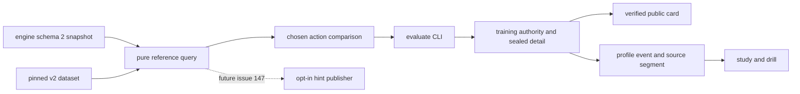

# #150 기준표 커버리지 확장 설계

구현 기준 소스 `2e1bda863d77f0b14208aaa391f6c4bc48226880`, 2026-09-08. 선행 사실과 측정은 연구 측정 기록 (배포 보고서의 요약 참조), 작업 순서와 검증은 [implementation-plan.md](issue-150-plan.md).

## 1. 목표와 출시 경계

기본 cash-training에서 유효한 single-open 상황을 데이터 누락 때문에 버리지 않고, 8/9인 테이블에서도 위치를 정확히 구분한다. 제한적인 스택/사이즈 차이는 **투영된 참고**로 제공하되, 직접 비교한 평가와 학습 통계를 분리한다. #147이 호출할 순수 추천 조회 API까지 제공한다.

첫 출시의 범위는 아래처럼 고정한다. 이 범위로 #150의 제안 항목을 구체화하며, 모든 예시 깊이의 독립 차트를 만든다는 약속은 하지 않는다.

| 차원 | v2 직접 지원 | 투영 참고 | 제외 |
|---|---|---|---|
| 게임 | cash-training, 표준 베팅 규칙 | 없음 | tournament/ICM, unknown mode, ante/rake 등 모델에 없는 조건 |
| 테이블 인원 | 6, 8, 9명 | 인원 투영 없음 | 2~5, 7명 및 잘못된 topology |
| 스택 | 100bb | 실제 유효 스택 80~120bb를 100bb로 | 그 밖. 40/60/150bb 차트를 복제해 만들지 않음 |
| 직면 오픈 raise-to | 2.5bb ±기존 0.05bb 정수칩 허용오차 | 2~3bb를 2.5bb로 | 그 밖, 복수 오픈/콜러 |
| 사용자 RFI raise-to | 2.5bb ±0.05bb | 2~3bb를 2.5bb로 | 그 밖 행동 비교 불가 |
| 사용자 3bet raise-to | 8.5bb ±0.05bb | 6.5~10.5bb를 8.5bb로 | 그 밖 행동 비교 불가 |
| 트리 | unopened RFI 또는 앞선 raise 정확히 1, call 없음 | 트리 투영 없음 | 림프, cold-call, squeeze, 4bet+, postflop |

투영 폭은 **이번 제품의 제한적 참고 범위로 선택한 공학적 정책**이며 전략 정확도 연구 결과가 아니다. 직접 지원과 투영을 묶어서 실력 성장/분포 일치율의 표본으로 사용하지 않는다. 좁은 stack 범위를 택한 이유는 기본 게임에서 drift가 없고, 더 먼 깊이를 뒷받침할 독립 자료가 없기 때문이다. #150의 40/60/80/100/150 예시보다 좁은 첫 버전이다. 9인 과거 tournament 세션이 자동으로 지원되는 것도 아니다.

4bet+/limp 제외는 #143 대기가 아니다. #143은 종료됐다. 현재 원본 빈도표에 해당 전략 트리가 없다는 독립적인 범위 제한이다. #147 UI/토글/힌트 노출 기록/통계 오염 방지와 postflop solver는 이번 구현 범위 밖이다.

## 2. 설계 결정

1. **추천 조회와 행동 비교를 나눈다.** 미선택 상태의 추천은 사용자 chosenAction에 의존하지 않는다.
2. **정책과 기준표를 분리한다.** opponent hand-strength/distribution/sizing을 평가의 정답 출처로 사용하지 않는다. 정책 v1/v2의 기존 동작과 정책 버전도 이 변경 때문에 바꾸지 않는다.
3. **v1을 보존하고 v2를 추가한다.** 옛 source triple, dataset bytes, evaluator, spot parser를 읽을 수 있다. 새로운 표를 옛 source identity로 표시하지 않는다.
4. **인원·hero·opener를 키에 모두 담는다.** 새 포지션을 6-max UTG로 조용히 축약하지 않는다.
5. **투영 provenance는 통계까지 보존한다.** 디테일/summary/event 사이에서 탈락하면 숫자와 등급을 비활성화한다.
6. **게임 규칙을 고쳐 커버리지를 인위적으로 높이지 않는다.** 이미 있는 cash top-up을 유지하고, 상대 행동을 기준표 트리에 강제하지 않는다.

## 3. 순수 조회 API와 데이터 흐름

신규 `training/preflop-reference.js`:

```js
resolvePreflopReference(snapshot, pinnedDataset)
// -> {status, decisionId, spot, actions, source, coverage}

comparePreflopChoice(snapshot, reference)
// -> {chosen, grade, coverage}; raw chosenAction을 수정하지 않음
```

`resolve...`는 파일/네트워크/LLM/정책 호출 없이 입력 객체와 pin된 dataset만 사용한다. `snapshot.chosenAction`을 전혀 읽지 않는다. 반환 객체는 immutable이고 같은 입력에 같은 결과다. 현재 schema 2의 authoritative legal 증거를 요구한다. v1 기록 재평가는 기존 v1 API를 사용한다.

`compare...`는 snapshot.decisionId/상황의 동일성 및 조회 결과의 내부 provenance를 검사한다. 호출자가 임의로 만든 source/actions를 authoritative reference처럼 넘길 수 없도록 provider의 현재 WeakMap pin 방식과 같은 비복제 객체 결박을 사용한다. 퍼블릭 JSON 객체만으로 비교 권한을 얻지 못한다.



사전 API는 source/actions/coverage만 반환한다. `evaluationId`, chosen frequency, grade, EV는 만들지 않는다. 실제 action을 받아 평가할 때만 기존 evaluationId 규약을 적용한다. 엔진 스냅샷/핸드 기록에는 이번 변경으로 hintShown을 추가하지 않는다.

조회 시 legal.canCheck/canRaise, callAmount와 raise 범위에 대해 **positive-frequency 액션 모두**를 검증한다. 불가능한 액션이 하나라도 있으면 `REFERENCE_ACTION_ILLEGAL`로 전체 추천을 거절한다. 불가능한 raise를 지우거나 maxRaiseTo로 clamp 후 나머지 빈도를 재정규화하지 않는다. all-in으로 바뀐 액션을 보통 3bet과 동일시하지 않는다.

추천 chip amount는 `round(sizeBb * bb)`가 정수칩 표현 허용오차 ±0.05bb 내일 때만 계산한다. 의도한 값과 실제 칩 표현 모두 provenance에 기록한다. BB가 작아 표현 오차가 커지거나 합법 범위를 넘으면 지원하지 않는다. #143의 SB 단위 정책 라운딩 함수를 호출하지 않는다.

## 4. 상황 정규화와 key

신규 `shared/preflop-key.js`는 v1/v2 key의 구문, 직렬화, UI label을 담당한다. 지원 여부는 구문 통과만이 아니라 pinned dataset의 명시적 key membership으로 판단한다.

키 예:

```text
6max-100bb-hj-rfi-unopened                 # legacy v1
6max-100bb-hj-vs-single-raise              # legacy v1, opener unknown
6max-100bb-hj-rfi-v2                      # v2
6max-100bb-hj-vs-utg-open25-v2             # v2, expected 3bet 8.5bb
9max-100bb-co-vs-lj-open25-v2
```

기존 UI의 세 번째 `-` 필드도 위치가 되도록 유지하지만, 새 소비자는 반드시 parser를 사용한다. '-' 내부 위치명 대신 `utg1`, `utg2`를 사용한다. key는 최대 100자, public schema/URL 문법을 지킨다. 핸드 클래스는 유효한 169개와 실제 두 장 카드의 일관성을 검증한다.

프리플랍 행동 순서:

| 인원 | canonical order | 엔진에서 달라지는 label |
|---|---|---|
| 6 | UTG HJ CO BTN SB BB | UTG+1 → HJ |
| 8 | UTG UTG1 LJ HJ CO BTN SB BB | UTG+1 → UTG1, +2 → LJ, +3 → HJ |
| 9 | UTG UTG1 UTG2 LJ HJ CO BTN SB BB | UTG+1 → UTG1, +2 → UTG2, +3 → LJ, +4 → HJ |

`out:false`의 시작 참여 좌석 수를 사용하고 folded 좌석을 빼서 테이블 인원을 줄이지 않는다. actor/opener는 유일하게 publicSeats에 존재하고 position도 일관되어야 한다. priorActions의 raise playerId로 오프너를 찾는다. 앞선 참여자의 처리와 action order를 검증하며 opener는 hero보다 앞선 canonical 순서여야 한다. hero가 이미 행동하고 다시 차례를 받은 reopened 트리는 지원하지 않는다. BB의 unopened/불가능한 UTG vs-open은 dataset key를 만들지 않는다. HU 매핑은 공용 position decoder에서만 문서화하고 reference capability에는 넣지 않아 dead reachable-claim을 없앤다.

vs-open 스택은 `min(hero.stack + hero.contribution, opener.stack + opener.contribution)`으로 계산한다. unopened는 기존 effectiveStack 의미를 유지하되 관련 opponent 총액을 수집한다. 비균질한 cash 스택 입력은 `UNSUPPORTED_STACK_CONFIGURATION`로 거절하여 아직 대응하지 않은 숏스택을 무시하지 않는다. 새 지원 게임은 엔진 cash-training이라 핸드 시작 총액이 동일하므로 이 검증을 통과한다. raw effectiveStack과 computed effectiveStack 둘 다 남기며 source snapshot을 고치지 않는다.

모드/숫자/배열/ID/position/카드가 malformed면 오류다. 유효하지만 범위를 벗어난 상태는 unsupported다. 누락 입력을 100bb, 6명, UTG, 2.5bb로 대체하지 않는다. 현재 엔진 schema 2의 config가 ante/rake를 제공하지 않는 것은 고정된 제품 모델의 전제다. 향후 해당 필드/모델 도입 시 capability revision을 올려야 하며 자동 호환으로 취급하지 않는다.

## 5. v2 원본 빈도표

`training/data/preflop-baseline-v1.json/.sha256`는 그대로 남긴다. 새 `preflop-baseline-v2.json/.sha256`를 추가하고 provider id는 `local-preflop-baseline`, version은 `2.0.0`이다. dataset schemaVersion은 2로 구별한다. 로컬 builder가 생성한 원본 heuristic이다.

v2 100bb native tree에는 RFI 20개(5+7+8), legal hero/opener pair 79개(15+28+36), **총 99개 key × 169 hand classes = 16,731개 행**을 만든다. 세 좌석 수의 순서대로 가능한 opener-before-hero pair를 전부 생성한다. 다른 opener를 같은 key에 넣지 않는다.

재현 가능한 원본 규칙을 아래로 고정한다. 이 수치는 포커 강도 검증이 아니라 기존 스케치를 확장한 출처 공개 정책이다. 외부 chart/상용 solver/정책 strength estimate를 읽지 않는다.

- 기존 `rfiMix` 및 `vsRaiseMix`를 v1 byte-for-byte 생성용으로 보존한다. 순수 legacy recipe 모듈 추출 시 빌드 결과 SHA가 같아야 한다.
- 6인 RFI는 v1과 같다. 8인 UTG/UTG1/LJ는 각각 v1 UTG raise frequency × 0.65/0.80/1.00, 9인 UTG/UTG1/UTG2/LJ는 × 0.50/0.65/0.80/1.00. HJ/CO/BTN/SB는 대응 v1 recipe를 사용한다.
- `AA`, `KK`, `QQ`, `AKs`, `AKo`는 위 신규 early-position scaling에서도 native RFI raise=1을 유지한다. 나머지 남은 확률을 fold에 둔다.
- vs-open 기본 벡터는 v1 `vsRaiseMix(hand)`다. opener 계수는 UTG=.60, UTG1=.65, UTG2=.70, LJ=.75, HJ=.85, CO=.95, BTN=1.10, SB=1.20. 콜 계수에 추가로 hero가 opener보다 포스트플랍 OOP면 .85, IP면 1.00을 곱한다. BTN이 마지막, SB가 첫 번째, BB가 두 번째인 포스트플랍 순서를 사용한다.
- rawRaise=baseRaise×openerFactor, rawCall=baseCall×openerFactor×heroPositionFactor. rawRaise+rawCall>1이면 둘을 비례 정규화하고 fold=0, 그 외 fold=1−합. `AA/KK/QQ`는 3bet=1, call=fold=0의 premium override다.
- frequency는 1/10,000 정수 단위로 largest-remainder 배분한다. 동률은 고정 action order `raise,call,fold`; 0행은 생략한다. 합은 정확히 10,000, EV는 전 행 null이다. 구현자가 임의로 전략 계수를 바꾸지 않는다. 변경은 generator 버전/설계 변경 및 독립 리뷰 대상이다.

빌더는 `--version 1|2 --out-dir ABS --check`를 지원하도록 한다. 기본 실행은 v2 정본을 재생성하고, v1은 명시해서 재현한다. `--check`는 쓰기 없이 byte/digest/source registry 일치를 검사한다. v2 expected SHA는 실제 생성물에서만 산출한다. 설계에서 임의 hash를 정하지 않는다. README에 recipe, coefficient 표, 지원 범위, 투영 폭, 비GTO/EV-null 성격을 함께 기록한다.

native 원본 계수를 가진 표가 있어야 그 영역을 '직접 기준표 비교'라고 부를 수 있다. 이것이 최적 전략이나 좋은 학습 효과를 입증하는 것은 아니다. 다른 깊이의 독립 native table은 후속 데이터 연구 대상으로 둔다.

## 6. coverage와 투영 계약

v2 recommendation/평가의 `coverage`는 고정 schema 1의 closed object다. 필드를 모르면 거절한다. 내부 숫자는 finite, nonnegative, nullable 규약을 명시적으로 검사한다.

```json
{
  "schemaVersion": 1,
  "referenceMatch": "projected",
  "choiceMatch": "exact",
  "metricEligible": false,
  "reasonCodes": ["STACK_PROJECTED"],
  "input": {
    "bbChips": 50,
    "seated": 6, "position": "HJ", "openerPosition": "UTG",
    "rawEffectiveStackChips": 5600,
    "computedEffectiveStackChips": 5600,
    "heroTotalChips": 5600, "openerTotalChips": 5600,
    "opponentTotals": [
      {"playerId":"p1", "totalChips":5600},
      {"playerId":"p2", "totalChips":5600},
      {"playerId":"p3", "totalChips":5600},
      {"playerId":"p4", "totalChips":5600},
      {"playerId":"p5", "totalChips":5600}
    ],
    "effectiveStackBb": 112,
    "facingRaiseToChips": 125, "facingRaiseToBb": 2.5,
    "chosenRaiseToChips": null, "chosenRaiseToBb": null,
    "legal": {
      "canCheck": false, "canRaise": true,
      "actorBetChips": 0, "callAmountChips": 125,
      "minRaiseToChips": 200, "maxRaiseToChips": 5600
    }
  },
  "reference": {
    "seated": 6, "stackBb": 100,
    "openRaiseToBb": 2.5, "threeBetRaiseToBb": 8.5,
    "sizing": {
      "action": "raise", "intendedSizeBb": 8.5,
      "raiseToChips": 425, "representedSizeBb": 8.5
    }
  },
  "policyVersion": "preflop-projection-v1"
}
```

위 예시는 6인 동액 112bb의 vs-open에서 call을 평가한 경우다. 필드 집합/순서는 예시와 같으며 다음 규칙을 적용한다. 모든 `*Chips`는 nonnegative safe integer, bbChips는 positive safe integer다. ratio는 칩/BB로 재계산하며 `Number.EPSILON * max(1,abs(expected)) * 8` 이내만 동일하게 본다. 구조/범위의 chip exactness와 ratio 표현오차를 혼동하지 않는다. opponentTotals는 현재 대응 가능한 opponent의 `{playerId,totalChips}`만 포함하고 playerId lexical sort, 중복 금지, 최대 8행이다. hero/opener total과 raw/computed effectiveStack의 계산은 §4 및 canonical snapshot에 결박한다.

openerPosition/openerTotal/facingRaiseTo의 nullable 필드는 RFI에서만 null이다. chosenRaiseTo 두 필드는 query 또는 non-raise choice일 때만 null이고, raise choice이면 실제 선택 칩/BB가 들어간다. reference.sizing은 해당 상황 native RFI/3bet 액션이 있을 때의 하나의 sizing 객체이며, 전체 행이 fold/call뿐이면 null이다. unsupported 결과의 reference는 null이고 평가 가능한 input은 남기되 malformed input에 대해 coverage를 합성하지 않는다. v2 context가 유효하지만 mode/count/topology부터 unsupported라 구조화된 input을 완성할 수 없는 경우, 별도 query failure `{status:'unsupported',decisionId,actions:[],source,code,reason,coverage:null}`을 반환한다. 이 경우 metricEligible는 helper에서 false로 계산하며 null coverage를 지원 결과로 승격하지 않는다. reasonCodes는 enum의 고정 정의 순서로 정렬하고 중복을 금지한다.

사전 조회의 choiceMatch는 `not-observed`, metricEligible는 false다. 비교 후 referenceMatch/choiceMatch가 둘 다 exact이고 !forced일 때만 metricEligible=true다. chosen action이 기준표에서 확률 0인 합법적인 fold/call/raise라면 구조적으로 exact인 off-policy 행동이다. '표에 없는 액션'과 '범위 밖 사이즈'를 혼동하지 않는다. positive-frequency reference action의 합법성은 별도다.

직면 스택/오픈 size 투영 여부는 선택 전 결정한다. chosenRaiseToBb 투영은 비교 때만 추가한다. native 비교에서 chip tolerance로 match되는 경우 원시 선택을 보존하고 기존 tolerance 함수만 사용한다. nearest-size 투영을 `REFERENCE_SIZE_TOLERANCE_BB`에 섞지 않는다. 여러 기준 사이즈에 동시에 match되면 reject한다. 허용 경계는 포함, 경계 밖 epsilon/NaN/string/Infinity는 범위 밖 또는 malformed로 정해진 실패를 반환한다.

`referenceMatch=unsupported`이면 actions=[]이고 `metricEligible=false`. 유효 reference에 choice size만 범위 밖이면 reference actions는 유지하되 `choiceMatch=unavailable`, grade/chosen.frequency=null, 통계 제외다. reference가 projected이거나 choice가 projected이면 grade/chosen.frequency=null로 두어 projected 선택을 점수화하지 않는다. `evBb/bestEvBb/evLossBb`는 모든 경우 null이다.

v2 evaluation.status는 reference를 찾은 경우 supported, 못 찾으면 unsupported다. 따라서 모든 새 소비자는 status만 보고 채점할 수 없다. shared `referenceAssessmentEligibility(evaluation)`가 source exact triple, v2 coverage, metricEligible의 **재계산된 일치**, 선택/원본 근거를 검사한다. optional 플래그 Boolean 하나를 신뢰하지 않는다. v1은 기존 검증 규약으로 해석한다. v2인데 coverage 누락이면 unverified, 등급·수치 집계 불가다.

진단 reason code는 안정적인 enum이다: `MODE_UNSUPPORTED`, `SEAT_COUNT_UNSUPPORTED`, `POSITION_INVALID`, `STACK_OUT_OF_RANGE`, `UNSUPPORTED_STACK_CONFIGURATION`, `LIMP_OR_CALLER`, `FOUR_BET_PLUS`, `FACING_SIZE_OUT_OF_RANGE`, `CHOICE_SIZE_OUT_OF_RANGE`, `DATASET_SPOT_MISSING`, `REFERENCE_ACTION_ILLEGAL`, `STACK_PROJECTED`, `FACING_SIZE_PROJECTED`, `CHOICE_SIZE_PROJECTED`. 유효 입력의 독립 blocker를 모두 수집하며 canonical 순서의 첫 사유를 primary로 사용한다. 기존 v1 code/reason/digest를 다시 쓰지는 않는다.

## 7. 출처 공존, persistence, recovery

### 7.1 Registry와 세션 선택

`shared/reference.js`에 immutable `KNOWN_REFERENCE_SOURCES`를 두어 v1/v2 **id+version+hash 전체 일치**만 heuristic-reference로 인정한다. `CANONICAL_REFERENCE_SOURCE`는 새 v2 기본 선택의 별칭이지 과거 신뢰 allowlist 전체가 아니다. fake-solver는 synthetic 유지, 같은 version에 다른 hash는 무조건 unverified다. registry에 경로/모델/실행 권한은 넣지 않는다.

`tools/preflop-dataset.js`는 bundled source registry로만 source→정본 파일을 찾는다. 새 임의 경로를 session metadata에서 실행/로드하지 않는다. legacy `--dataset` 인터페이스는 dataset pin 검증과 학습 authority 검증을 분리한 채 보존한다.

새 세션은 catalog commit 전에 생성되는 session-local `reference-source.json`에 v2 triple을 기록하고 이후 바꾸지 않는다. session lifecycle 아래 private regular file로 원자적 생성·bounded read한다. `tools/game-loop.js`가 소유한 loop lock 안에서 bootstrap/resume 선행 점검한다. resume에서 파일이 없으면 **legacy v1**로 한 번 귀속하며 기존 authority/evaluation source와 충돌하는 경우 halt한다. 파일이 있으면 내용 malformed/unknown/mismatched이면 fail-closed; 파일 손실을 v2 업그레이드 신호로 보지 않는다. 세션에서 이미 v2 평가가 있고 파일이 사라졌다면 v1으로 조용히 바꾸지 않고 REFERENCE_SOURCE_CONFLICT다. 다른 provider의 postflop item은 baseline 선택 결정에서 제외한다.

training authority의 기존 item source와 descriptor를 교차 확인하고, 모든 preflop CLI/flush/recovery는 동일 session 선택 함수를 통과한다. active v1 세션은 끝까지 v1, 다음 새 세션부터 v2다. 자동 재평가는 하지 않는다. legacy opponent policy는 v1 dataset+normalizer를 명시적으로 사용한다. 평가 v2 전환이 policy v1의 전략을 바꾸지 않는다.

### 7.2 봉인된 coverage

`publish-contract.js`의 TRAINING_SUMMARY_KEYS 끝에 optional coverage를 추가하고 strict projector를 공용화한다. v1에서 없는 키를 serialize하지 않아 **기존 canonical bytes/digest가 유지**되어야 한다. 신규 v2에서는 coverage를 필수로 검증한다. evaluation detail, summary, payload hash, detail hash, authority item, profile event까지 같은 필드가 반영된다.

`tools/training-control.js`의 accept와 materialize에서 v2의 detail projected summary가 authority summary와 정확히 같은지 확인한다. accept 때 canonical completed hand record의 user decisionId를 찾아 원본 snapshot으로 동일 pinned source의 순수 query/compare를 재계산하고 status/actions/grade/chosen/coverage와 일치해야 받는다. hand record가 없거나 source가 불가하면 pending/unavailable이고 evaluator의 자기 신고를 신뢰하지 않는다. 이미 accepted인 materialize는 그때 봉인한 detail/summary/authority digest를 검증한다. summary에만 exact로 바꾸거나 detail의 raw 값을 바꾸는 경우에도 거절한다. 오래된 v1 summary/detail 검증을 약화하지 않는다. 설명/exploit의 non-numeric 후처리가 coverage를 덮어쓸 수 없다.

기존 training authority schema 2는 item payload의 version-aware optional extension을 읽을 수 있게 확장한다. 프로필 event/profile은 schema 5로 올린다. schema 1~4의 원본 이벤트는 append-only 보존하고 projection만 rebuild한다. manifest/event/profile의 시작·재시도/flush/소비 후 크래시 각 지점에서 기존 잠금 및 exactly-once 구조를 유지한다.

### 7.3 프로필과 study

v2 event에는 sourceIdentity와 coverage를 보존한다. exact/eligible만 기존 점수·mix calibration·mistake/retest 후보로 들어간다. projected와 comparison unavailable은 별도 coverage 집계 및 히스토리에 보인다. count 필드 의미:

- `evaluatedDecisions`: 모든 비중복 사용자 평가. forced는 별도 forfeits로도 집계.
- `referenceAvailableDecisions`: !forced이고 검증된 reference.actions를 얻은 건수.
- `exactComparableDecisions`: 재검증된 metricEligible 건수. 기존 supported/score 표본 의미는 여기에 대응.
- `projectedReferenceDecisions`: reference 또는 choice가 projected인 건수.
- `comparisonUnavailableDecisions`: reference는 있으나 선택 비교 불가인 건수.
- `unsupportedDecisions`: reference가 없음. `unverifiedDecisions`는 독립 provenance 문제이며 다른 사유와 겹칠 수 있다.

raw coverage와 exact statistics를 명시적으로 분리한다. source triple별 segment의 score/calibration은 섞지 않는다. v1/v2 reference가 섞인 overall은 coverage 합만 제공하고 grade/calibration은 active source segment에서 가져온다. active segment는 '최근 유효 게임 이벤트의 source, 없으면 최근 유효 연습 source, 둘 다 없으면 기본 v2'로 정하며 UI에 표시한다. 단순히 bundle 버전을 올렸다고 빈 v2 segment로 옛 성과를 사라지게 만들지 않는다.

`tools/study-summary.js`도 내부 `.game`/`.practice` 전체 합산으로 버전 간 학습 개선을 계산하지 않는다. assessment/retest는 원래 source triple와 같은 question set이 있어야 한다. 과거 v1 question/mistake는 bundled v1로 재개 가능하고 v2 source로 바꿔 채점하지 않는다. source hash 확인 실패나 데이터 제거는 SOURCE_UNAVAILABLE로 종료한다. 기존 판정/답안을 덮어쓰지 않는다.

롤백은 old binary로 v2 store를 여는 방식이 아니다. v2 읽기를 지원하는 수정 버전으로 roll-forward한다. 릴리스 전 compatibility test는 구형 reader의 정지/지원 경계를 확인하며, source-write rollback은 신규 테스트 store를 폐기하는 범위에 국한한다.

## 8. UI와 학습 흐름

이번 UI 변경은 사후 학습 카드와 study/drill만이다. verified detail의 coverage로 '직접 기준표 비교', '투영 참고: 112bb → 100bb', '선택 사이즈 비교 불가'를 구분한다. 투영은 빈도와 사이징의 **참고값**을 보이되 grade, mastery, modal agreement, mistake 후보, retest 개선 수치에는 넣지 않는다. 숫자를 볼 때 같은 카드에 투영 원인/출처 버전이 보이도록 한다. 투영 필드가 검증되지 않으면 참고 수치도 숨긴다.

`training/opportunities.js`, drill의 고정 8-key 목록, hardcoded provider 경로, key.split 기반 라벨을 source-aware parser/catalog로 교체한다. native v2 key만 신규 drill 질문으로 생성한다. 투영 상황에서 drill을 만들 경우 사용자의 112bb 상황을 복원한 문제라고 표시하지 않고, 명시적인 100bb native 연습으로 별도 시작한다. 자동 mistake/retest 유도는 하지 않는다.

기존 6-max 100BB 고정 안내인 `gtoEvalNotice`도 신규 capability 기반으로 수정한다. unsupported 및 projected 안내를 구별하고 solver/GTO 검증 주장은 유지 금지다. 사용자에게 보여주는 범위와 evaluator가 실제 허용하는 범위가 일치해야 한다.

해설/종합 리뷰도 소비자다. `tools/training-pipeline.js`의 buildExplanationPrompt는 source+coverage의 분류와 metric eligibility를 전달하고, aggregateProcessRows/trainingAggregate는 referenceAvailable와 exactComparable를 분리한다. `tools/game-loop.js`의 종합 evaluator prompt에서 `qualified reference grades`는 exactComparable에만 대응하고, projected 건수는 별도 제한 문장으로 전달한다. `training/process-review.js`도 같은 helper를 사용한다.

투영 카드의 `112bb → 100bb`, 관측/기준 사이즈 및 빈도는 **봉인된 데이터의 기계 렌더러만** 출력한다. LLM은 projected/choice-unavailable 건에서 비채점·비수치 보충 설명만 작성하며 '직접 비교', '최적', 실제 실력/EV와 같은 표현을 허용하지 않는다. `training/explain.js`의 validator는 이 branch에서 모든 수치 주장을 거절한다(기존에 허용하는 handNo는 유지). exact 건은 기존 수치 결박을 보존한다. coverage가 없이 supported/source만 존재하는 v2 설명은 unavailable 처리한다. prompt에 coverage를 넣고 기존 숫자 validator를 그대로 두는 불완전한 변경은 허용하지 않는다.

## 9. #147에 넘기는 계약

#150 완료 시 reference query의 동일 input→동일 actions/source/coverage가 동결되어 있어야 한다. #147은 이를 호출하여 hint를 만들고, source authority와 decision identity를 token-authenticated SSE에 결박할 수 있다. 이번 버전에 hints는 게시하지 않는다.

#147의 후속 설계 항목: opt-in/off 기본값, stale async 결과 폐기, hint가 실제 공개됐을 때 exposure 기록과 profile 배제, check/call 및 all-in-call/all-in-raise 구분, maxRaiseTo clipping 금지, 사이즈의 raise-to/additional semantics. 정확한 팟 비율은 기존 actorBet을 반영한 **raise increment / (potBefore + toCall)** 등 UI에서 선택한 정의를 명시해야 하며 지금 이슈 예시의 110%를 그대로 규약으로 삼지 않는다. 수치 퍼센트는 승률/성공 확률이 아니라 출처 기준 행동 빈도다.

## 10. 구현 준비 판정 기준

아래 계약 및 implementation plan의 검증 행렬에 결정 미정인 동작을 남기지 않는다. 측정 보고의 지원 상한을 미래 품질 보장으로 사용하지 않는다. 독립 리뷰의 blocker를 해소한 후 `READY_FOR_IMPLEMENTATION_WITH_BOUNDED_SCOPE`로 보고한다. native frequency recipe의 품질은 별도의 포커 전략/인간 학습 평가가 필요하며 이번 판정은 그 품질 인증이 아니다.

## 구현 시 확정한 복구와 집계 규칙

출처 descriptor 생성은 lifecycle 경로에만 둔다. accept는 읽기 전용 조회를 배치당 한 번 실행하며, v2 descriptor 부재는 `REFERENCE_CONTEXT_UNAVAILABLE`로 거절하고 파일을 만들지 않는다. evaluator의 descriptor 없는 legacy 조회도 쓰지 않는다. 손상된 출처나 canonical 기록은 추정하여 복구하지 않는다. 원본을 복원한 뒤 호환 바이너리로 재시도한다.

schema 4의 derived profile만 있고 원본 profile-events 저널이 없으면 schema 5로 재구축할 근거가 없어 `UNSUPPORTED_PROFILE`로 중단한다. 원본 파일을 보존하고 동일 store의 일치하는 저널을 백업에서 복원해야 한다. 집계값으로 원본 이벤트를 합성하거나 구 버전으로 강제 변환하지 않는다. 저널이 있는 schema 1~4는 show/rebuild/digest migration 모두 지원한다.

종합 리뷰의 supported는 exactComparable이다. 분모는 total = supported + unsupported + nonComparableSupported이며 forced도 별도 진단 수로 제공한다. 게임의 verified referenceAvailable 이벤트는 투영뿐이어도 active source를 갱신한다. source별 점수와 calibration은 계속 분리한다.

측정 도구는 봉인된 기존 평가의 supported/exact 수를 그대로 집계하고, 지원 확대 연구용 blocker 진단은 명시적으로 v2 API에 재질의한다. 따라서 v1 기록의 historical metric을 v2 재평가 점수로 대체하지 않는다. 데이터셋의 key metadata는 closed key grammar와 전역 capability에서 유도하며 같은 값을 99번 중복 저장하지 않는다.
